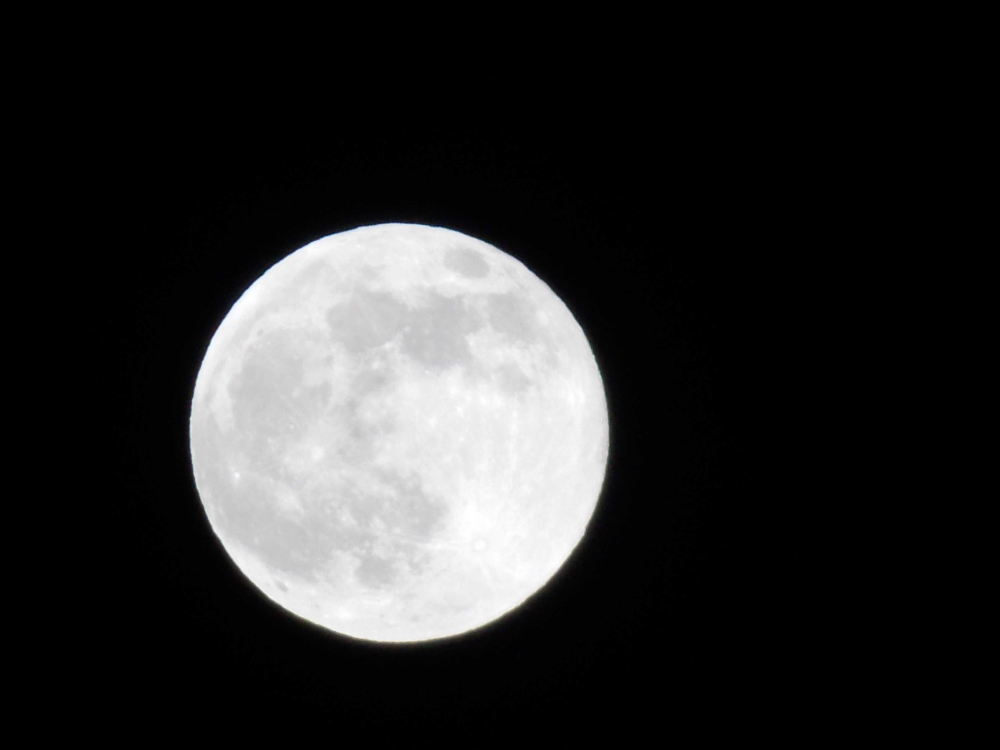

# J124-Data-Journalism
“Intro to Data Journalism Markdown practice resume

# Ashley Dionicio
## Hello! My name is Ashley and I am a crocheter, painter, photogropher, and a student at UC Berkeley.

*A picture I took of the moon during the 2021 blood moon with my phone*

## Skills 
1. Advanced in Adobe Photoshop
2. Advanced in Adobe Illustrator 
3. Proficient in Adobe Premiere  
5. Fluent in Spanish 

Employer | Job Description
---------|----------------
LA Law Library|<ul><li>Helped inform people on legal awareness</li><li>Distributed information about legal workshops</li><li>Helped create a system of online forms </li></ul> 
BUILD Literacy|<ul><li>Helped elementary aged children with reading comprehension</li><li>Helped students build better reading practices </li><li>Helped children exercise writing abilities</li></ul>
LATTC & LADWP| <ul><li>Created online lesson plans for public use </li><li>Created 3D models of community spaces </li><li>Created plans for ergonomic community spaces </li></ul>
